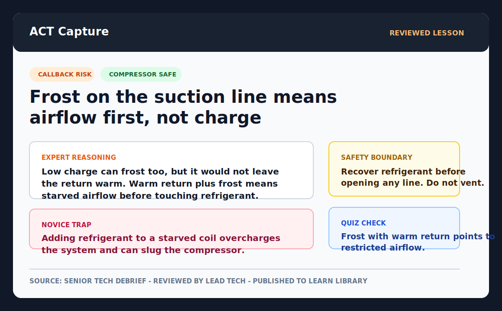

# ACT - Actober AI

**Your best HVAC techs retire. Their judgment does not have to.**

ACT helps HVAC teams capture what their best senior technicians know while they are doing real jobs, then turns those teachable moments into training for newer techs. The goal is to help companies reduce callbacks and keep important field knowledge from walking out the door when experienced techs retire. AI agents work behind the scenes to capture events, detect teachable moments, ask post-job questions, compile cards, enforce review, and measure outcomes.



> "Generic training teaches your new hire what a capacitor is. It cannot teach them how your lead tech, who retires in 14 months, fixes the recurring fault at your three biggest commercial accounts. We capture that, before he leaves, and put it on every truck."

ACT is not a live copilot telling techs what to do in the field. It is the capture layer for company-specific judgment. The expert stays in control, AI handles the paperwork between human gates, and a lead tech approves every lesson before an apprentice sees it.

**Capture -> Detect -> Ask -> Structure -> Review -> Teach -> Measure**

## Why It Matters

HVAC operators already feel every one of these:

- **High callbacks**: industry-average first-time-fix is about 80%; a typical callback runs [about $650 (ACCA)](https://hvac-blog.acca.org/the-true-cost-of-callbacks-and-how-to-stop-the-bleeding/), with inadequate documentation and technician knowledge gaps among named causes.
- **Retiring senior techs**: when a 30-year tech retires, the diagnostic shortcuts that keep callbacks low on that operator's own install base retire with them. Nobody wrote it down, because writing it down was never the job.
- **Inconsistent diagnosis**: two techs on the same account, same fault, often reach different conclusions — one from pattern recognition built over a decade, one from guesswork. That inconsistency is what shows up downstream as a callback or a return visit.
- **New hires slow to billable**: [new hires can take 6-12 months to full productivity](https://thebluecollarrecruiter.com/hvac-technician-turnover-costs-jacksonville-the-real-cost-of-hvac-technician-turnover-a-jacksonville/), and much of early attrition happens in the first 30-90 days; [replacing a technician can cost 100-150% of salary](https://applausehq.com/blog/how-retaining-your-home-services-technicians-saves-thousands-vs-hiring).
- **Weak field documentation**: senior techs are rarely willing or able to write up their reasoning after a full day of calls, so the knowledge that would shorten a new hire's ramp never gets captured in the first place.

ACT is built to close exactly these gaps: the expert's real reasoning, from a real job, with no writing required.

## What Works Today

The ACT loop runs end to end against the deployed backend at `https://act-api-evode.fly.dev`.

| Step | Live capability |
| --- | --- |
| Capture | One-button, glove-friendly job recording with consent state, "mark this" taps, and offline upload retry/resume. |
| Detect | Postgres-backed processing pipeline for frame extraction, Deepgram transcription, moment detection, and Claude ranking. |
| Ask | Approved moments auto-chain into drafted debrief questions. The senior tech sees a waiting-question badge and answers by voice, guided voice debrief, or text. |
| Structure | Expert answers compile into lesson cards with evidence grounding, novice traps, safety boundaries, and quiz checks. |
| Review | Mobile and web-admin gates keep lead tech approval in the loop; nothing publishes itself. |
| Teach | Mobile Learn library, web lessons portal, and Ask ACT, which answers only from published cards with citations and refuses live job diagnosis. |
| Measure | Per-job outcome capture, callback / first-time-fix signals, dashboard summaries, and weekly operator reports. |
| Trust | Invite-only auth, server-side token verification, per-account tenant isolation, and customer-requested redaction / purge. |

## The Product

ACT creates one durable training object from one real teachable moment:

1. **Record** - a senior tech captures a real job from a phone, chest mount, or existing camera.
2. **Mark** - the tech taps moments worth remembering: sensory cue, safety call, verification step, counterfactual, novice trap.
3. **Detect** - the backend processes video, audio, transcript, and frames to propose expertise-rich moments.
4. **Ask** - after the job, ACT asks the expert the question an apprentice would ask if they knew what to notice.
5. **Structure** - the answer becomes a lesson card: situation, cue, reasoning, trap, safety boundary, quiz.
6. **Review** - a lead tech approves, edits, or rejects before publishing.
7. **Measure** - apprentice usage and job outcomes show whether the lesson reduced callback risk and improved ramp.

The expert never has to write documentation. The apprentice gets company-specific judgment, not generic textbook training.

## Buyer And Users

The buyer is the ops director, regional service director, or service manager at a multi-site HVAC operator, consolidator, or franchise network. They care about callbacks, first-time-fix, technician ramp, turnover, and consistency across branches.

The users are different:

- **Senior techs** capture real jobs and answer quick debrief questions.
- **Lead techs** review and publish the lessons.
- **Apprentices and newer techs** learn from approved company-specific cards.
- **Operators** track whether the training is moving callback and ramp metrics.

ACT is not for solo shops first, and it is not generic apprentice training. The wedge is operators with enough volume, turnover, and repeated job patterns to make captured institutional knowledge valuable.

## Positioning

Generic simulation training, such as [Interplay Learning](https://www.interplaylearning.com/industries/hvac/), teaches the textbook: how a heat pump works, how to braze, how to troubleshoot a typical system.

ACT is the layer above that. It captures how your best tech diagnoses your hardest jobs on your accounts, with your equipment history, your customer context, your install patterns, and your recurring failure modes.

That non-genericness is the moat.

## Go To Market

The first motion is a **60-day paid concierge pilot**:

- One HVAC operator
- One senior or retiring technician
- One callback-prone install base or branch
- About 20 company-specific training cards from real jobs
- A before / after read on callbacks, first-time-fix, apprentice confidence, and manager-observed ramp

The pilot is intentionally narrow. It proves willingness to pay for captured company knowledge before building self-serve onboarding.

## Current Wedge

First trade: HVAC residential and light-commercial troubleshooting.

Best early job types:

- No-cool / no-heat calls
- Refrigerant and airflow diagnosis
- Compressor protection and verification
- Electrical faults inside HVAC workflow
- Repeated failures on known accounts or install types

Why HVAC first:

- Tight feedback loops: no-cool and no-heat are repeated, controlled events.
- Measurable outcomes: first-time-fix, callbacks, time-to-diagnosis, and return visits.
- Rich tacit signals: sound, vibration, line temperature, frost pattern, gauge readings, filter state, static pressure.
- Large labor market: BLS reports [425,200 HVAC mechanics/installers in 2024, 8% projected growth through 2034, and about 40,100 openings per year](https://www.bls.gov/ooh/installation-maintenance-and-repair/heating-air-conditioning-and-refrigeration-mechanics-and-installers.htm).

Beyond HVAC, the same retirement and ramp problem appears across trades. Earlier electrical discovery remains in the codebase behind trade-aware knowledge stubs, but HVAC is the first pilot market.

## Product Guardrails

- **No custom hardware first.** Use phones, chest mounts, GoPros, or existing smart glasses until the software loop proves what hardware is missing.
- **Not surveillance.** Expert-controlled capture, explicit consent state, redaction paths, and review gates are product requirements.
- **No real-time diagnosis promises.** Ask ACT answers from published training cards only; it does not diagnose live jobs.
- **Do not keep everything.** Keep the moments that carry judgment: shortcuts, sensory cues, counterfactuals, thresholds, safety boundaries, verification steps, customer/context reads.
- **Humans keep judgment.** Automation runs between approval gates, never around them.

---

## Repo Layout

This repo contains the mobile client, web admin, and marketing site. The backend lives in a sibling repo.

- `apps/mobile` - React Native Expo app for capture, review, debrief, learning, and outcomes
  - `src/screens/CaptureJobScreen.tsx` - record, mark teachable moments, upload with retry
  - `src/screens/DebriefScreen.tsx` - pending questions, voice/text answers, guided voice debrief
  - `src/screens/PilotReviewScreen.tsx` - review, debrief, compile, publish
  - `src/screens/LearnScreen.tsx` - apprentice-facing library and quiz events
  - `src/screens/PilotOutcomeScreen.tsx` - callback / first-time-fix / ramp signal capture
  - `src/api/captureApi.ts`, `src/api/libraryApi.ts` - typed clients for the deployed backend
- `apps/admin` - Next.js pilot admin: review queue, debrief answers, publish gate, web lessons portal (`/learn`)
- `apps/site` - Actober AI marketing site: static export, privacy, support, store-link slots
- `packages/act-kb` - trade-aware knowledge stubs; electrical retained pending migration
- [`../act-api`](https://github.com/Evode-Manirahari/act-api) - Python FastAPI backend, deployed at `https://act-api-evode.fly.dev`

## Stack

- **Mobile**: React Native, Expo SDK 54, TypeScript, Zustand
- **Backend**: Python 3.13, FastAPI, async SQLAlchemy 2.0, Alembic, PostgreSQL, durable Postgres job queue
- **AI**: Claude via the Anthropic Python SDK; Deepgram `nova-3` speech-to-text
- **Storage**: Cloudflare R2 for video and extracted frames
- **Auth**: Supabase invite-only auth, server-side JWT verification, per-account tenant isolation
- **Monorepo**: pnpm workspaces

## Run The Mobile Slice

```bash
pnpm install
cd apps/mobile
pnpm start
```

Then on your phone:

1. Install **Expo Go** ([iOS](https://apps.apple.com/app/expo-go/id982107779) | [Android](https://play.google.com/store/apps/details?id=host.exp.exponent)).
2. Make sure phone and Mac are on the same WiFi.
3. Scan the QR code in the terminal, or paste `exp://<lan-ip>:8081` via "Enter URL manually".

Mobile reads the API base URL through `apps/mobile/src/lib/config.ts`. Set `EXPO_PUBLIC_API_BASE_URL` for local dev; otherwise it falls back to the deployed backend.

Backend env vars live in `act-api/.env.example`. Pilot deployment steps are in [`docs/hvac-pilot-go-live.md`](docs/hvac-pilot-go-live.md).

## Product Framing

Say:

- "Cut callbacks and ramp new hires faster by capturing your senior techs' company-specific reasoning before they retire."
- "Your senior techs pass on what they know without writing a word, captured from real jobs in their own words."
- "Generic training teaches the textbook. ACT captures the way your company actually solves recurring jobs."

Do not say:

- "AI tells techs what to do in real time."
- "Generic apprentice training for solo shops."
- "Fully automated publishing."

## Engineering Workflow

AI-assisted workflow tooling, including gstack skills and gbrain memory, is documented in [`docs/internal-tooling.md`](docs/internal-tooling.md).

OpenClaw is available as an optional pilot notification/control channel. Setup
and usage live in [`docs/openclaw.md`](docs/openclaw.md).

## License

MIT - see [LICENSE](LICENSE).
